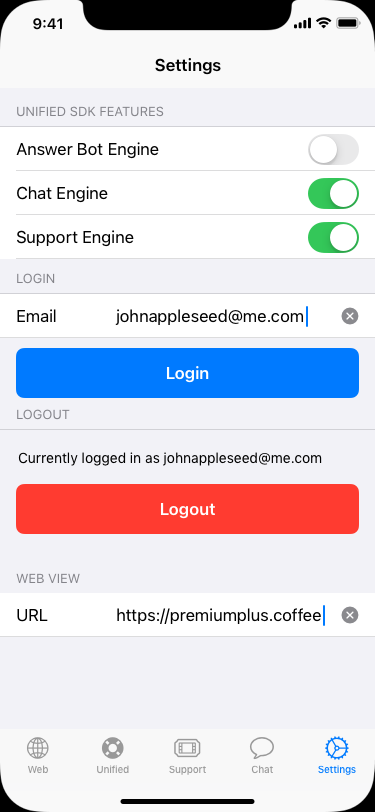

# Changelist
Zendesk created a new SDK, the Zendesk SDK that will replace all other now Legacy SDKs. For this reason we will no longer need the Chat SDK but will still need the two other APIs since they are richer in features for now.

# What
Demo iOS app to show of the [Zendesk SDK](https://developer.zendesk.com/embeddables/docs/zendesk-sdk-for-ios/getting_started) and [Unified Zendesk SDK](https://developer.zendesk.com/embeddables/docs/ios-unified-sdk/getting_started) and [Support SDK](https://developer.zendesk.com/embeddables/docs/ios_support_sdk/nutshell)

# How
Universal iOS App for iPhone and iPad

Five tabs:

1. Load SFViewcontroller to somedomain.com
2. Open Zendesk SDK
3. Open Unified SDK with Chat, Answer Bot and Support Engine Loaded
4. Open Support SDK with 3 buttons: New Request, Show Help Center, My Requests
5. Settings Tab

## Zendesk SDK
https://developer.zendesk.com/embeddables/docs/zendesk-sdk-for-ios/getting_started
The Unified SDK should check for and load all three engines.
The tint color should be #2f2a95

## Unified SDK
https://developer.zendesk.com/embeddables/docs/ios-unified-sdk/introduction
The Unified SDK should check for and load all three engines.
The tint color should be #2f2a95

	func buildUI() throws -> UIViewController {
	   let messagingConfiguration = MessagingConfiguration()
	   let answerBotEngine = try AnswerBotEngine.engine()
	   let supportEngine = try SupportEngine.engine()
	   let chatEngine = try ChatEngine.engine()
	   return try Messaging.instance.buildUI(engines: [answerBotEngine, supportEngine, chatEngine],
											 configs: [messagingConfiguration])
	   }

## Support SDK
https://developer.zendesk.com/embeddables/docs/ios_support_sdk/about
The Support tab has 3 buttons that load respectively the following configurations:

> The SDK provides the following UIs for both Support and Guide to embed customer service features in an app:
> - Help Center Overview - Lets the user access articles in your Zendesk Guide knowledge base and, optionally, submit a ticket. See Adding Help Center
> - Request - Lets the user view, update, and submit tickets to your customer service team. See Show a ticket screen
> - Request List - Lets the user view a list of their tickets. See Show the user's tickets

The tint color should be The tint color should be #2f2a95

# Settings tab
## Toggle Unified Settings
Disable or Enable Chat/Support/Answer Bot Engine

## JWT authentication

JWT authentication with a service provider of your choice or if known:

- Auth0
- Google Workplace
- Okta

Since it's a demo application it doesn't really matter where we authenticate, we can move user auth of the demo Zendesk environment.

## Swift
Preferably written in Swift

# Icons
SF icons:
- Web: globe
- Zendesk: questionmark.circle
- Unified: lifepreserver
- Support: ticket
- Settings: Gear

# References
- Code can be copied from https://github.com/zendesk/ios_sdk_demo_apps
- See also [Remember the date](https://github.com/zendesk/sdk_demo_app_ios) on the [App Store](https://apps.apple.com/be/app/remember-the-date/id944696609) for an example on how the SDK works.

# What we can provide:
- Access and tokens for premiumplusdemo.zendesk.com environment
- Access to our Auth0 (or if needed other) auth platform

# Screenshots
## Web

## Unified SDK

## Support SDK
 

## Chat

## Settings

## iPad

